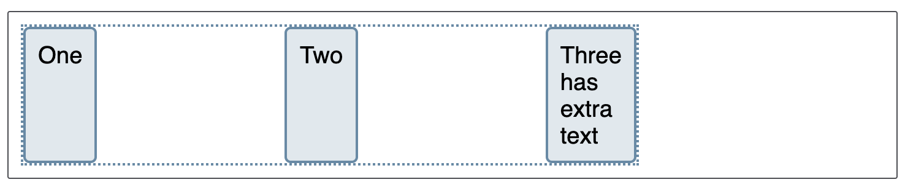

# CSS3 flexible box layout (lankčios dėžutės išdėstymas :D)

* Kartu su CSS3 atsirado naujos galimybės nusakyti kaip elementai turi būti išdėstomi (prieš tai mes naudojome float).
* Vienas iš tokiu būdų yra naudoti `display: flex` (dar yra `display: grid` , bet apie jį pašnekėsim vėliau).
* Kartu su `display: flex` galima naudoti tokias CSS3 savybes (ang. )properties, kaip:
    * **justify-content**: flex-start | flex-end | center | space-between |
space-around | space-evenly | start | end
    * **flex-direction**: row| column | row-reverse | column-reverse
    * **flex-wrap**: nowrap | wrap | wrap-reverse
    * **order**: int number.
* **flex** yra skirtas pakeisti **float** ir **table** paremta elementų išdėstymą. 

---

```css
.box {
    display: flex;
    justify-content: space-between;
}
```

```html
<div class="box">
    <div>One</div>
    <div>Two</div>
    <div>
        Three
        <br>has
        <br>extra
        <br>text
    </div>
</div>
```

---

