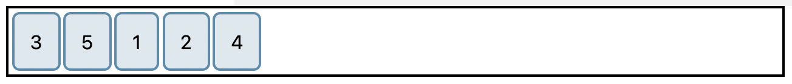

# Užduotis 2

Turite toki html dokumentą:

```html
<!DOCTYPE html>
<html>
    <head>
        <style>
            .box {
                display: flex;
                border: 2px solid black;
                padding: 2px;
            }

            .box :nth-child(1) { order: 2; }
            .box :nth-child(2) { order: 3; }
            .box :nth-child(3) { order: 1; }
            .box :nth-child(4) { order: 3; }
            .box :nth-child(5) { order: 1; }

            .box > * {
                border: 2px solid rgb(96, 139, 168);
                border-radius: 5px;
                background-color: rgba(96, 139, 168, .2);
                padding: 10px;
                margin-right: 2px;
            }
        </style>
    </head>
    <body>
        <div class="box">
            <div>1</div>
            <div>2</div>
            <div>3</div>
            <div>4</div>
            <div>5</div>
        </div>
    </body>
</html>
```

Ji atidarius matysite:



Padarykite taip kad būtų vaizdas kaip parodyta žemiau:

