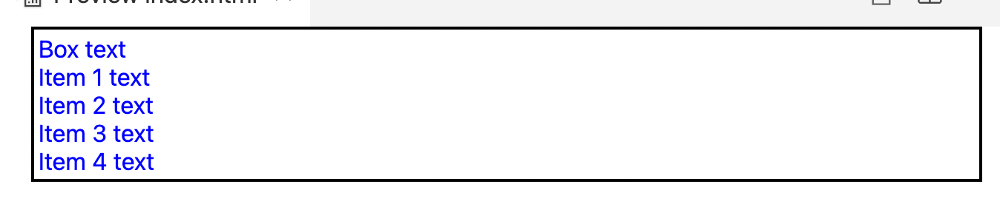
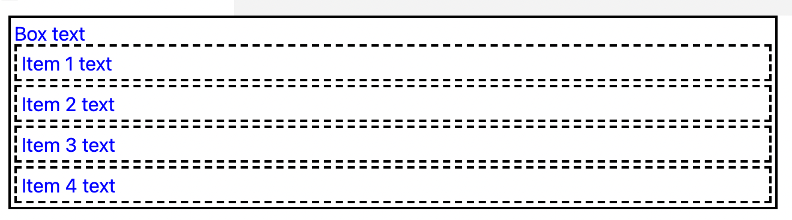

# Inherited (paveldimos) ir non-inherited (nepaveldimos) properties (savybės) I

CSS savybės gali būti skirstomos į dvi kategorijas:
* **inherited** savybės, kurios pagal nutylėjimą turi taip vadinamas paskaičiuotas reikšmės (computed values). Paskaičiuotos reikšmės yra apibrėžiamos kaip reikšmės, kurios perduodamos iš tėvynio (ang. parent), vaikiniam (ang. child) elementui. Tokių CSS savybių pavyzdžiai yra padding, margin, border ir t.t.
* **non-inherited** savybės, kurios pagal nutylėjimą turi pradines reikšmes, pavyzdžiui, `h1` teksto dydis turi numatytą reikšmę. Teksto spalvą irgi yra pagal nutylėjimą juoda :D

Panagrinėkime du pavyzdžius:

```html
<!DOCTYPE html>
<html>
    <head>
        <style>
            .box {
                color: blue;
                border: 2px solid black;
                padding: 2px;
            }
        </style>
    </head>
    <body>
        <div class="box">
            Box text
            <div class="item">Item 1 text</div>
            <div class="item">Item 2 text</div>
            <div class="item">Item 3 text</div>
            <div class="item">Item 4 text</div>
        </div>
    </body>
</html>
```

---



---

```html
<!DOCTYPE html>
<html>
    <head>
        <style>
            .box {
                color: blue;
                border: 2px solid black;
                padding: 2px;
            }

            .box > * {
                border: 2px dashed black;
                padding: 3px;
            }

            .box :not(:last-child) {
                margin-bottom: 2px;
            }
        </style>
    </head>
    <body>
        <div class="box">
            Box text
            <div class="item">Item 1 text</div>
            <div class="item">Item 2 text</div>
            <div class="item">Item 3 text</div>
            <div class="item">Item 4 text</div>
        </div>
    </body>
</html>
```

---

