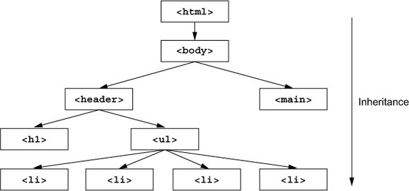

# Inherited (paveldimos) ir non-inherited (nepaveldimos) properties (savybės) II

Citata iš **CSS in depth**

<cite>
Not all properties are inherited, however. By default, only certain ones are. In general, these are the properties you’ll want to be inherited. They are primarily properties pertaining to text: color, font, font-family, font-size, font-weight, font-variant, font-style, line-height, letter-spacing, text-align, text-indent, text-transform, white-space, and word-spacing.

A few others inherit as well, such as the list properties: list-style, list-style -type, list-style-position, and list-style-image. The table border properties, border-collapse and border-spacing, are also inherited; note that these control border behavior of tables, not the more commonly used properties for specifying borders for non-table elements. (We wouldn’t want a `div` passing its border down to every descendant element.) This is not quite a comprehensive list, but very nearly.
</cite>
