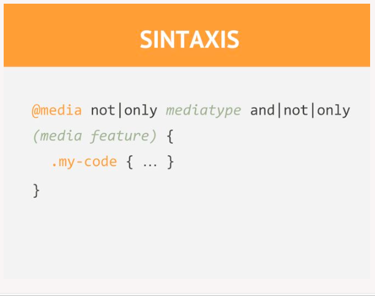
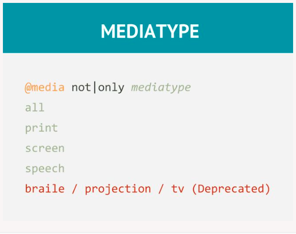
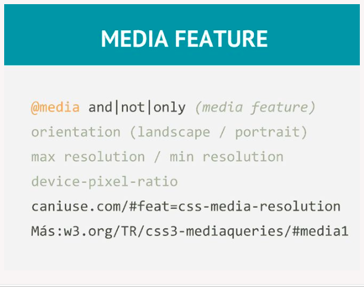

# Media query (responsive design)

* Media query (`@media`) tai yra CSS3 naujas funkcionalumas leidžiantis taikyti tam tikras CSS taisykles priklausomai nuo ekrano dydžio.
* Media query (`@media`) yra pagrindas norint sukurti tinklapį skirta tiek mobiliesiems, tiek ir paprastiems kompiuteriams

Pagrindinė media-query sintaksė:

---



---



---



---

Pavyzdis:

```css
@media screen and (min-width: 480px) {
    body {
        background-color: lightgreen;
    }
}
```

Kai naudojamas media ir bendrai rekomenduojama i `head` pridėti tokia eilutę:

```html
<meta name="viewport" content="width=device-width, initial-scale=1" />
```

tam, kad atidarant tinklapį nebūtų galimybės daryti "zoom" (priartinimo).

---
```html
<!doctype html>
<head>
  <style>
    :root {
      font-size: 0.75em;
    }
    @media (min-width: 800px) {
      :root {
        font-size: 0.875em;
      }
    }
    @media (min-width: 1200px) {
      :root {
        font-size: 1em;
      }
    }

    body {
      font-family: Helvetica, Arial, sans-serif;
    }

    .panel {
      padding: 1em;
      border: 1px solid #999;
      border-radius: 0.5em;
    }
    .panel > h2 {
      margin-top: 0;
      font-size: 0.8rem;
      font-weight: bold;
      text-transform: uppercase;
    }
  </style>
</head>

<body>
  <div class="panel">
    <h2>Single-origin</h2>
    <div class="body">
      We have built partnerships with small farms around the world to
      hand-select beans at the peak of season. We then carefully roast
      in <a href="#">small batches</a> to maximize their
      potential.
    </div>
  </div>
</body>
```
---

Daugiau informacijos:

[https://developer.mozilla.org/en-US/docs/Web/CSS/Media_Queries/Using_media_queries](https://developer.mozilla.org/en-US/docs/Web/CSS/Media_Queries/Using_media_queries)